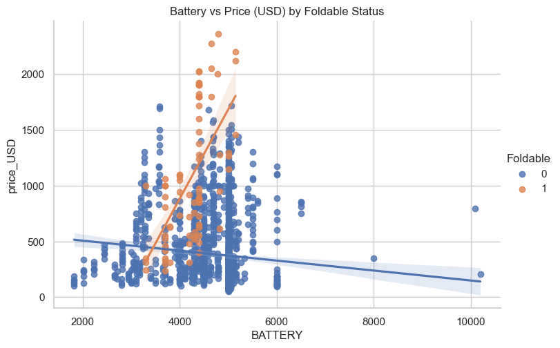

# Phone Infomration 2024 Classification

### [dataset](https://www.kaggle.com/datasets/willianoliveiragibin/phone-information-2024)

Author: [Kevin Thomas](mailto:ket189@pitt.edu)

License: [CC0 1.0 Universal](https://creativecommons.org/publicdomain/zero/1.0)

## **Executive Summary**

### **Objective**

This report presents the development and evaluation of a binary classification model designed to analyze patterns in demographic, health, occupational data, and smartphone specifications to predict health-related outcomes and device market trends. Using a dataset with variables such as age, work hours, physical activity hours, price, storage, battery capacity, and various device and health indicators, the model aims to uncover associations and insights into demographic, occupational, and market impacts on health, stress factors, and consumer preferences.

---

### **Data Insights**

#### **1. Continuous Variables Analysis**
- **Age, Sleep Hours, Work Hours, and Smartphone Variables:** 
  - **Age, Sleep Hours, and Work Hours Distributions:** Histograms exhibit balanced distributions without strong skewness, indicating even representation across ranges. 
  - **Smartphone Variables:** Marginal distributions of **price**, **price_USD**, and **BATTERY** show strong right skewness, suggesting higher values are less common. **Storage** and **RAM** display multi-modal distributions, reflecting preferences for specific configurations. **Weight** and **Display_Size** are more symmetric, clustered around common values, indicating standardization in design.
  - **Relationships:** Scatter plots of Sleep_Hours vs. Age (faceted by Occupation) show flat trends, indicating weak or no correlations. Similarly, pair plots among Age, Sleep_Hours, Work_Hours, and Physical_Activity_Hours confirm minimal interdependence, while smartphone features like storage, display size, and weight exhibit stronger correlations.
  - **Correlation Matrix:** Variables like **price** and **price_USD** (correlation: 0.99), **Weight** and **Display_Size** (0.75), and **Year** with **quantile_50** (0.80) highlight significant associations. Moderate correlations include **storage** with price (0.67) and **RAM** with PPI_Density (0.48).

#### **2. Categorical Variables Analysis**
- **Gender, Occupation, Country, and Severity:** Bar charts show balanced gender representation, varied occupational groups, and even distributions across countries like the USA, Canada, Australia, and the UK. Health severity levels reveal "Low" severity as most common, followed by "Medium" and "High."
- **Smartphone Features:** 
  - **Foldable Status and Year Trends:** The binary feature Foldable is dominated by non-foldable devices, while Year reflects an increasing trend in device releases, peaking in 2022 and 2023.
  - **Other Features:** **USB types** favor modern USB Type-C connectors, while **sensor configurations** highlight diverse combinations like fingerprint sensors, accelerometers, and gyroscopes. **Color options** span extensive palettes, reflecting manufacturers’ focus on differentiation.
- **Interrelationships:** Heatmaps and bar charts reveal demographic and market patterns. Gender and occupation combinations show higher counts in specific health severity levels, while smartphone trends like **price**, **battery**, and **storage** differ between foldable and non-foldable devices.

#### **3. Advanced Visualizations**
- **Demographic and Health Comparisons:** Box plots of Age, Sleep Hours, and Work Hours across Gender, Occupation, and Country show overlapping ranges and similar medians, suggesting uniform distributions within demographic groups.
- **Smartphone Market Dynamics:** Trends in pricing, battery, and display characteristics across Foldable Status and Year highlight market evolution. Trend lines with shaded confidence intervals reveal category-specific relationships, such as diverging slopes in storage and price between foldable and non-foldable devices.

---

### **Model Development and Selection**

#### **Model Evaluation**
- **Performance:** The binary classification model achieved an accuracy of 50.3% and an ROC AUC of 49.1%, reflecting near-random performance. Despite limited predictive power, statistically significant predictors were identified:
  - **Key Predictors:**
    - **Geographic and Occupational Influences:** Interaction terms like `C(Occupation)[T.IT]:C(Country)[T.Germany]` (coefficient: -3.8900, p-value: 0.0297) and `C(Occupation)[T.Engineering]:C(Country)[T.India]` (coefficient: 3.4107, p-value: 0.0307).
    - **Physical Activity and Price Trends:** **Physical_Activity_Hours** (coefficient: 38.5331, p-value: 0.0357) and **price_USD** (negative coefficient) reveal significant but mixed effects on prediction.

---

### **Implications**

Although the model demonstrates limited predictive accuracy, it highlights significant patterns. In health analysis, occupation, country, and physical activity show potential impacts on stress and severity levels. In smartphone trends, features like price, storage, and battery exhibit associations with market preferences and evolving technologies. These findings underscore the value of targeted analyses and refined modeling approaches to uncover deeper insights.

---

### **Recommendations and Next Steps**

1. **Improve Model Accuracy:** Employ alternative algorithms (e.g., gradient boosting) and advanced feature engineering to enhance performance.
2. **Investigate Feature Interactions:** Further analyze interaction terms, particularly between demographics, occupations, and device features.
3. **Address Data Imbalances:** Balance datasets or apply stratified sampling to mitigate the impact of uneven distributions.
4. **Expand Data Collection:** Incorporate additional health-related or market-specific features to capture broader influences.
5. **Enhance Smartphone Analysis:** Focus on emerging technologies like foldable devices and high-density displays to refine market insights.

---

### **Conclusion**

This analysis highlights demographic, occupational, and smartphone market dynamics while uncovering associations between health and device attributes. Despite its limitations, the model provides a foundation for further exploration, particularly in understanding consumer preferences and health-related patterns. Refinements in feature selection, data collection, and modeling can yield more actionable insights.

## Import Main Modules & Dataset


```python
import numpy as np
import pandas as pd
import matplotlib.pyplot as plt
import seaborn as sns
```


```python
import itertools
```


```python
import statsmodels.formula.api as smf
```


```python
df = pd.read_csv('processed_data news.csv')
```

## Perform Basic Analysis


```python
df.shape
```


    (1715, 31)


```python
df.dtypes
```


    phone_brand            object
    phone_model            object
    store                  object
    price                 float64
    currency               object
    price_USD             float64
    storage                 int64
    ram                     int64
    Launch                 object
    Dimensions             object
    Weight                float64
    Display_Type           object
    Display_Size          float64
    Display_Resolution     object
    OS                     object
    NFC                     int64
    USB                    object
    BATTERY                 int64
    Features_Sensors       object
    Colors                 object
    Video                  object
    Chipset                object
    CPU                    object
    GPU                    object
    Year                    int64
    Foldable                int64
    PPI_Density             int64
    quantile_10            object
    quantile_50           float64
    quantile_90            object
    price_range            object
    dtype: object


```python
_ = [print(f'{df[column].value_counts()}\n') for column in df.columns]
```

    phone_brand
    samsung      432
    xiaomi       427
    apple        194
    motorola     142
    oneplus       77
    google        69
    realme        67
    oppo          57
    nokia         52
    honor         49
    huawei        32
    asus          31
    sony          24
    nothing       20
    zte           13
    vivo          12
    tecno          5
    tcl            4
    infinix        3
    blackview      3
    htc            1
    cubot          1
    Name: count, dtype: int64
    
    phone_model
    Apple iPhone 15 Pro            12
    Xiaomi Redmi Note 12 4G        11
    Google Pixel 8 Pro             11
    Samsung Galaxy S22 Ultra 5G    11
    Apple iPhone 14 Pro Max        10
                                   ..
    ZTE nubia Z60 Ultra             1
    Realme C67                      1
    Oppo Reno8 Pro                  1
    OnePlus Nord N20 SE             1
    Realme C11                      1
    Name: count, Length: 472, dtype: int64
    
    store
    Amazon DE     585
    Amazon UK     488
    Amazon US     455
    AliExpress     97
    Best Buy       48
    Samsung        33
    Motorola        7
    Oneplus         2
    Name: count, dtype: int64
    
    price
    999.99    13
    199.99    13
    159.99    12
    129.99    11
    99.99     10
              ..
    107.50     1
    226.97     1
    264.59     1
    87.00      1
    213.85     1
    Name: count, Length: 1250, dtype: int64
    
    currency
    USD    642
    EUR    585
    GBP    488
    Name: count, dtype: int64
    
    price_USD
    999.99    12
    199.99     9
    299.99     7
    249.99     6
    159.99     6
              ..
    150.08     1
    137.61     1
    118.39     1
    136.91     1
    205.87     1
    Name: count, Length: 1429, dtype: int64
    
    storage
    256     627
    128     555
    512     306
    64       93
    1000     69
    32       65
    Name: count, dtype: int64
    
    ram
    8     571
    12    361
    4     313
    6     312
    16     86
    3      64
    2       5
    24      3
    Name: count, dtype: int64
    
    Launch
    2023-09-22    36
    2021-09-24    30
    2022-09-16    25
    2024-09-20    23
    2023-02-17    23
                  ..
    2023-08-01     1
    2024-04-04     1
    2024-04-07     1
    2022-07-19     1
    2021-03-11     1
    Name: count, Length: 337, dtype: int64
    
    Dimensions
    164.2 x 76.1 x 8.1 mm (6.46 x 3.00 x 0.32 in)    27
    159.9 x 73.9 x 8.1 mm (6.30 x 2.91 x 0.32 in)    21
    160.5 x 74.5 x 8.3 mm (6.32 x 2.93 x 0.33 in)    19
    164.2 x 75.9 x 9.1 mm (6.46 x 2.99 x 0.36 in)    19
    159.9 x 75.1 x 8.4 mm (6.30 x 2.96 x 0.33 in)    15
                                                     ..
    167.2 x 76.5 x 9.4 mm (6.58 x 3.01 x 0.37 in)     1
    162 x 76.5 x 9.1 mm (6.38 x 3.01 x 0.36 in)       1
    Unfolded: 156.9 x 141.5 x 5.3 mm                  1
    162.3 x 78.6 x 9.1 mm (6.39 x 3.09 x 0.36 in)     1
    163.8 x 75 x 7.8 mm (6.45 x 2.95 x 0.31 in)       1
    Name: count, Length: 397, dtype: int64
    
    Weight
    190.0    75
    189.0    61
    196.0    60
    187.0    59
    195.0    56
             ..
    523.0     1
    199.8     1
    238.0     1
    217.5     1
    627.0     1
    Name: count, Length: 119, dtype: int64
    
    Display_Type
    PLS LCD                                                                                     63
    LTPO Super Retina XDR OLED, 120Hz, HDR10, Dolby Vision, 1000 nits (typ), 2000 nits (HBM)    50
    Super Retina XDR OLED, HDR10, Dolby Vision, 800 nits (HBM), 1200 nits (peak)                48
    IPS LCD, 90Hz                                                                               47
    IPS LCD, 400 nits (typ)                                                                     41
                                                                                                ..
    LTPO AMOLED, 1B colors, 120Hz, Dolby Vision, HDR10+, 1200 nits (HBM), 1900 nits (peak)       1
    IPS LCD, 90Hz, 500 nits                                                                      1
    TFT LCD, 120Hz                                                                               1
    Super AMOLED, HDR10, 1000 nits (peak)                                                        1
    Super AMOLED Plus, 120Hz, 800 nits (HBM)                                                     1
    Name: count, Length: 262, dtype: int64
    
    Display_Size
    6.70     260
    6.50     229
    6.67     224
    6.60     129
    6.10     112
    6.80      79
    6.43      71
    6.40      64
    6.55      49
    6.53      42
    6.78      38
    6.74      35
    7.60      34
    6.52      27
    6.90      25
    6.30      25
    6.20      24
    5.80      24
    6.71      23
    6.58      22
    6.79      15
    6.56      15
    6.28      14
    4.70      12
    5.40      12
    6.73      12
    6.81       9
    5.92       9
    6.75       8
    5.90       8
    6.72       8
    7.92       6
    6.82       6
    6.44       6
    6.36       6
    6.59       5
    6.57       4
    6.00       3
    5.70       3
    6.88       3
    8.00       3
    6.62       2
    6.47       2
    6.49       2
    6.51       1
    8.70       1
    7.85       1
    12.40      1
    10.90      1
    6.86       1
    Name: count, dtype: int64
    
    Display_Resolution
    1080 x 2400    543
    720 x 1600     196
    1080 x 2340    146
    1080 x 2408     70
    1080 x 2412     59
                  ... 
    800 x 1340       1
    1440 x 2304      1
    1600 x 2560      1
    2224 x 2496      1
    1200 x 2652      1
    Name: count, Length: 68, dtype: int64
    
    OS
    Android 12, MIUI 13                                    47
    Android 13, up to 3 major Android upgrades, HyperOS    40
    Android 14, up to 7 major Android upgrades             39
    Android 11, MIUI 13                                    39
    iOS 17, upgradable to iOS 18                           36
                                                           ..
    Android 11, Funtouch 12                                 1
    Android 11, EMUI 12, no Google Play Services            1
    Android 11, upgradable to Android 12, ROG UI            1
    Android 10, Funtouch 10.0                               1
    Android 12, OxygenOS 12.1                               1
    Name: count, Length: 213, dtype: int64
    
    NFC
    1    1573
    0     142
    Name: count, dtype: int64
    
    USB
    USB Type-C 2.0, OTG                                                                          676
    USB Type-C 2.0                                                                               324
    USB Type-C 3.2, OTG                                                                          142
    Lightning, USB 2.0                                                                           135
    USB Type-C 3.2                                                                                54
    USB Type-C 3.1, OTG                                                                           54
    USB Type-C 3.1                                                                                41
    microUSB 2.0                                                                                  40
    USB Type-C 3.2 Gen 2, DisplayPort                                                             31
    USB Type-C 2.0, DisplayPort                                                                   28
    USB Type-C                                                                                    26
    USB Type-C 3.2, DisplayPort 1.2, OTG                                                          24
    microUSB 2.0, OTG                                                                             18
    USB Type-C, OTG                                                                               18
    USB Type-C 3.2, OTG, video output                                                             13
    USB Type-C 3.1, OTG, DisplayPort                                                              11
    USB Type-C 3.1, OTG, Display Port 1.2                                                         10
    USB Type-C 3.1, OTG, DisplayPort 1.4                                                           8
    USB Type-C 3.1, OTG, DisplayPort 1.2                                                           7
    USB Type-C 3.1, OTG, video output                                                              6
    USB Type-C 3.1, DisplayPort 1.2, OTG                                                           6
    USB Type-C 3.1, DisplayPort 1.4                                                                6
    USB Type-C 3.0                                                                                 5
    USB Type-C (side), DisplayPort 1.4; USB Type-C (bottom), OTG                                   5
    USB Type-C 3.2 Gen 2, OTG, accessory connector, DisplayPort                                    4
    USB Type-C 3.2 Gen 2, DisplayPort, OTG                                                         3
    USB Type-C 3.1 (side), USB Type-C 2.0 (bottom), OTG, accessory connector                       3
    USB Type-C 3.1, OTG, Display Port                                                              3
    USB Type-C 3.1 (side), DisplayPort 1.4; USB Type-C 2.0 (bottom), OTG, accessory connector      3
    USB Type-C 3.2, DisplayPort, OTG                                                               3
    USB Type-C 2.0, magnetic connector                                                             2
    USB Type-C 3.2, OTG, DisplayPort 1.4                                                           2
    USB Type-C 3.1 Gen2, OTG, DisplayPort 1.4                                                      2
    USB Type-C 3.2, OTG, DisplayPort                                                               1
    USB Type-C 3.0, OTG, accessory connector                                                       1
    Name: count, dtype: int64
    
    BATTERY
    5000     801
    4500     163
    4400      38
    4300      38
    4700      37
            ... 
    4230       1
    10200      1
    4820       1
    8000       1
    10090      1
    Name: count, Length: 90, dtype: int64
    
    Features_Sensors
    Fingerprint (under display, optical), accelerometer, gyro, proximity, compass                                206
    Fingerprint (side-mounted), accelerometer, gyro, proximity, compass                                          197
    Face ID, accelerometer, gyro, proximity, compass, barometer                                                  189
    Fingerprint (side-mounted), accelerometer, gyro, compass                                                     114
    Fingerprint (under display, ultrasonic), accelerometer, gyro, proximity, compass, barometer                  109
                                                                                                                ... 
    Accelerometer, compass                                                                                         1
    Fingerprint (side-mounted), accelerometer, gyro, proximity, compass, barometer, altimeter, color spectrum      1
    Fingerprint (under display, optical), accelerometer, gyro, proximity, color spectrum, compass                  1
    Fingerprint (under display, ultrasonic), Face ID, accelerometer, gyro, proximity, compass, color spectrum      1
    Accelerometer, proximity, compass                                                                              1
    Name: count, Length: 63, dtype: int64
    
    Colors
    Black Titanium, White Titanium, Blue Titanium, Natural Titanium     20
    Space Black, Silver, Gold, Deep Purple                              19
    Black, White, Peach, Blue                                           18
    Awesome Black, Awesome White, Awesome Violet, Awesome Blue          18
    Graphite, Gold, Silver, Sierra Blue, Alpine Green                   18
                                                                        ..
    Black, Gold, Silver                                                  1
    Force Black, Snowfall, Sapphire Blue (Jewel Blue)                    1
    Glazed Green, Glazed Black, House of the Dragon                      1
    Black, Silver, Photographer Edition                                  1
    Ceramic White, Ceramic Black, Ceramic Flora Green, Mountain Blue     1
    Name: count, Length: 416, dtype: int64
    
    Video
    1080p@30fps                                                                                             505
    1080p@30/60fps                                                                                           66
    4K@30fps, 1080p@30/60fps, gyro-EIS                                                                       43
    4K@24/25/30/60fps, 1080p@25/30/60/120/240fps, HDR, Dolby Vision HDR (up to 60fps), stereo sound rec.     40
    4K@30fps, 1080p@30/60/120fps, gyro-EIS                                                                   38
                                                                                                           ... 
    4K@30fps, 1080p@30fps, gyro-EIS, OIS                                                                      1
    4K@30fps (no OIS), 1080p@30/60fps                                                                         1
    4K@30/60fps, 1080p@30fps, gyro-EIS                                                                        1
    1440p@30fps, 1080p@30/60fps                                                                               1
    1440p@30fps                                                                                               1
    Name: count, Length: 164, dtype: int64
    
    Chipset
    Qualcomm SM6375 Snapdragon 695 5G (6 nm)      59
    Qualcomm SM8475 Snapdragon 8+ Gen 1 (4 nm)    56
    Qualcomm SM6225 Snapdragon 680 4G (6 nm)      55
    Apple A15 Bionic (5 nm)                       48
    Qualcomm SM8350 Snapdragon 888 5G (5 nm)      46
                                                  ..
    Kirin 710A (14 nm)                             1
    Mediatek Dimensity 8100 Max (5 nm)             1
    Unisoc T760 (6 nm)                             1
    Qualcomm SM7150-AC Snapdragon 732G (8 nm)      1
    Mediatek Dimensity 1100 (6 nm)                 1
    Name: count, Length: 158, dtype: int64
    
    CPU
    Octa-core (2x2.0 GHz Cortex-A75 & 6x1.8 GHz Cortex-A55)                                                    107
    Octa-core (2x2.2 GHz Cortex-A76 & 6x2.0 GHz Cortex-A55)                                                     77
    Octa-core (2x2.2 GHz Kryo 660 Gold & 6x1.7 GHz Kryo 660 Silver)                                             59
    Octa-core (4x2.4 GHz Kryo 265 Gold & 4x1.9 GHz Kryo 265 Silver)                                             55
    Octa-core (1x3.2 GHz Cortex-X3 & 2x2.8 GHz Cortex-A715 & 2x2.8 GHz Cortex-A710 & 3x2.0 GHz Cortex-A510)     45
                                                                                                              ... 
    Octa-core 1.8 GHz                                                                                            1
    Octa-core (1x3.05 GHz Cortex-X3 & 3x2.85 GHz Cortex-A715 & 4x1.80 GHz Cortex-A510)                           1
    Octa-core (2x2.2 GHz Cortex-A78 & 6x1.95 GHz Cortex-A55)                                                     1
    Octa-core (1x2.2 GHz Cortex-A76 & 3x Cortex-A76 & 4x Cortex-A55)                                             1
    Octa-core (4x2.0 GHz Cortex-A73 & 4x1.7 GHz Cortex-A53)                                                      1
    Name: count, Length: 128, dtype: int64
    
    GPU
    Mali-G57 MC2                       118
    Mali-G52 MC2                       110
    Adreno 619                         106
    Adreno 730                          98
    Adreno 610                          90
                                      ... 
    Mali-G78 MP24                        2
    Adreno 612                           2
    Apple GPU (three-core graphics)      2
    Adreno 613                           1
    Mali-G51 MP4                         1
    Name: count, Length: 76, dtype: int64
    
    Year
    2022    451
    2023    420
    2021    321
    2024    288
    2020    149
    2019     55
    2018     29
    2017      2
    Name: count, dtype: int64
    
    Foldable
    0    1632
    1      83
    Name: count, dtype: int64
    
    PPI_Density
    395    188
    460    109
    270    102
    409     69
    402     65
          ... 
    179      1
    429      1
    249      1
    243      1
    397      1
    Name: count, Length: 94, dtype: int64
    
    quantile_10
    114.99                    451
    118.913                   420
    127.5                     321
    161.756                   288
    10.109.599.999.999.900    149
    130.996                    55
    14.129.600.000.000.000     29
    16.978.300.000.000.000      2
    Name: count, dtype: int64
    
    quantile_50
    247.180    451
    330.675    420
    249.990    321
    552.385    288
    197.460    149
    249.000     55
    214.560     29
    197.315      2
    Name: count, dtype: int64
    
    quantile_90
    793.2                     451
    999.99                    420
    584.15                    321
    1.380.286                 288
    493.332                   149
    4.050.040.000.000.000      55
    311.688                    29
    22.484.699.999.999.900      2
    Name: count, dtype: int64
    
    price_range
    medium price    1366
    high price       176
    low price        173
    Name: count, dtype: int64
    


```python
df.nunique()
```


    phone_brand             22
    phone_model            472
    store                    8
    price                 1250
    currency                 3
    price_USD             1429
    storage                  6
    ram                      8
    Launch                 337
    Dimensions             397
    Weight                 119
    Display_Type           262
    Display_Size            50
    Display_Resolution      68
    OS                     213
    NFC                      2
    USB                     35
    BATTERY                 90
    Features_Sensors        63
    Colors                 416
    Video                  164
    Chipset                158
    CPU                    128
    GPU                     76
    Year                     8
    Foldable                 2
    PPI_Density             94
    quantile_10              8
    quantile_50              8
    quantile_90              8
    price_range              3
    dtype: int64


```python
df.price_range
```


    0         high price
    1          low price
    2          low price
    3       medium price
    4         high price
                ...     
    1710    medium price
    1711    medium price
    1712    medium price
    1713    medium price
    1714    medium price
    Name: price_range, Length: 1715, dtype: object


## Verify/Handle Missing Values 


```python
df.isna().sum()
```


    phone_brand           0
    phone_model           0
    store                 0
    price                 0
    currency              0
    price_USD             0
    storage               0
    ram                   0
    Launch                0
    Dimensions            0
    Weight                3
    Display_Type          0
    Display_Size          0
    Display_Resolution    0
    OS                    0
    NFC                   0
    USB                   0
    BATTERY               0
    Features_Sensors      0
    Colors                0
    Video                 0
    Chipset               0
    CPU                   0
    GPU                   0
    Year                  0
    Foldable              0
    PPI_Density           0
    quantile_10           0
    quantile_50           0
    quantile_90           0
    price_range           0
    dtype: int64


```python
df_copy = df.copy()
```


```python
df_copy = df_copy.dropna()
```


```python
df_copy.isna().sum()
```


    phone_brand           0
    phone_model           0
    store                 0
    price                 0
    currency              0
    price_USD             0
    storage               0
    ram                   0
    Launch                0
    Dimensions            0
    Weight                0
    Display_Type          0
    Display_Size          0
    Display_Resolution    0
    OS                    0
    NFC                   0
    USB                   0
    BATTERY               0
    Features_Sensors      0
    Colors                0
    Video                 0
    Chipset               0
    CPU                   0
    GPU                   0
    Year                  0
    Foldable              0
    PPI_Density           0
    quantile_10           0
    quantile_50           0
    quantile_90           0
    price_range           0
    dtype: int64


## Create Input & Output Vars


```python
df_copy.dtypes
```


    phone_brand            object
    phone_model            object
    store                  object
    price                 float64
    currency               object
    price_USD             float64
    storage                 int64
    ram                     int64
    Launch                 object
    Dimensions             object
    Weight                float64
    Display_Type           object
    Display_Size          float64
    Display_Resolution     object
    OS                     object
    NFC                     int64
    USB                    object
    BATTERY                 int64
    Features_Sensors       object
    Colors                 object
    Video                  object
    Chipset                object
    CPU                    object
    GPU                    object
    Year                    int64
    Foldable                int64
    PPI_Density             int64
    quantile_10            object
    quantile_50           float64
    quantile_90            object
    price_range            object
    dtype: object


```python
cat_input_vars = ['phone_brand',
                  'phone_model',
                  'store',
                  'currency',
                  'Launch',
                  'Dimensions',
                  'Display_Type',
                  'Display_Resolution',
                  'OS',
                  'USB',
                  'Features_Sensors',
                  'Colors',
                  'Video',
                  'Chipset',
                  'CPU', 
                  'GPU',
                  'quantile_10',
                  'quantile_90']
```


```python
cont_input_vars = ['price',
                   'price_USD',
                   'storage',
                   'ram',
                   'Weight',
                   'Display_Size',
                   'NFC',
                   'BATTERY',
                   'Year', 
                   'Foldable',
                   'PPI_Density',
                   'quantile_50']
```


```python
target = 'price_range'
```

## Exploratory Data Analysis

### Marginal Distributions Continuous Variables: Histograms and Density Plots
* The visualizations reveal the marginal distributions of key continuous and categorical features in the dataset, highlighting notable patterns and trends. Variables like price, price_USD, and BATTERY exhibit strong right skewness, indicating that higher values are uncommon, while storage and ram show multi-modal distributions, reflecting a preference for specific configurations. Features such as Weight and Display_Size are more symmetric but clustered around common values, suggesting standardization in design. PPI_Density and quantile_50 demonstrate wider spreads with distinct peaks, potentially influenced by device categories or market segmentation. The binary feature Foldable is dominated by non-foldable devices, and Year reflects an increasing trend in device releases, peaking in 2022 and 2023. These insights capture the variability and concentration within device attributes, offering a clear view of market preferences and trends over time.


```python
for cont in cont_input_vars:
    sns.displot(data=df_copy,
                x=cont,
                kind='hist',
                bins=20,
                kde=True)
    plt.xticks(rotation=90)
    plt.title(f'Marginal Distribution of {cont}')
    plt.show()
```


    

    


    

    


    

    


    

    


    

    


    

    


    

    


    

    


    

    


    

    


    

    


    

    


### Marginal Distributions Categorical Variables: Bar Charts
* The visualizations comprehensively depict the distribution and counts of various categorical and continuous features in the dataset, showcasing diversity and patterns in smartphone specifications. Phone models vary widely, with some models showing high prevalence, indicating market dominance. Store availability is concentrated on global retailers like Amazon, highlighting their critical role in device accessibility. Launch dates reflect a steady influx of releases, with peaks likely aligning with new technology waves. Dimensions and display types reveal significant variety, suggesting diverse consumer preferences and technological progress, while display resolutions cluster around industry standards. Operating systems and USB types illustrate a blend of modern and legacy standards, with USB Type-C particularly favored for connectivity. The sensor configurations show a notable range, with common inclusion of fingerprint sensors, accelerometers, and gyroscopes, reflecting functional diversity. Color options span an extensive palette, highlighting the manufacturers’ use of color to appeal to consumers. Advanced features like video capabilities, chipsets, CPUs, and GPUs underscore a high degree of technological diversity, with powerful configurations being common, emphasizing the focus on performance and user experience. Overall, these visualizations capture a complex interplay of consumer demand, technological evolution, and market dynamics, illustrating a multifaceted view of the smartphone industry’s competitive landscape.


```python
for cat in cat_input_vars:
    sns.catplot(data=df_copy,
                y=cat,
                kind='count',
                legend=False,
                aspect=0.3,
                height=48.0)
    plt.xticks(rotation=90)
    plt.title(f'Count of {cat}')
    plt.show()
```


    

    


    

    


    

    


    

    


    

    


    

    


    

    


    

    


    

    


    

    


    

    


    

    


    

    


    

    


    

    


    

    


    

    


    

    


### Continuous-to-Continuous Relationships or Conditional Distributions: Correlation Plot
* The correlation heatmap shows the relationships between various features related to phone specifications, including price, price in USD, storage, RAM, weight, display size, NFC, battery capacity, year, foldable status, PPI density, and a quantile feature labeled quantile_50. The price variable shows a strong positive correlation with price_USD (0.99) and moderate correlations with storage (0.67) and ram (0.55), indicating that higher storage and RAM are generally associated with higher prices. Weight has a strong correlation with Display_Size (0.75), suggesting that larger displays tend to make phones heavier. There is also a high correlation between Year and quantile_50 (0.80), which could indicate a trend in newer models aligning with this quantile. Other moderate correlations include PPI_Density with ram (0.48) and Foldable with Year (0.41), hinting at associations with display density and foldable technology in newer models.


```python
fig, ax = plt.subplots()
sns.heatmap(data=df_copy.drop(columns=[target]).\
            corr(numeric_only=True),
            vmin=-1, 
            vmax=1, 
            center=0,
            cbar=False,
            annot=True, 
            annot_kws={'size': 7},
            fmt='.2f',
            ax=ax)
plt.xticks(rotation=90)
plt.show()
```


    

    


### Continuous-to-Continuous Relationships w/ Categorical: Trend Plot
* These visualizations demonstrate the relationships between key continuous variables (e.g., price, storage, display size, PPI density) and how they interact with categorical groupings such as Foldable Status, NFC Status, or Year. The trend lines with shaded confidence intervals indicate the predicted relationship for each group, allowing for direct comparisons across categories. For instance, the impact of storage or battery capacity on price differs significantly between foldable and non-foldable devices, as shown by the diverging slopes. Similarly, changes in price trends over time reveal the evolving dynamics of pricing across years. This analysis provides insights into how categorical distinctions influence continuous relationships, offering nuanced understanding of these factors.


```python
sns.set(style='whitegrid')
lmplot_configs = [
    {'x': 'storage', 'y': 'price', 'hue': 'Foldable', 'title': 'Storage vs Price by Foldable Status'},
    {'x': 'ram', 'y': 'price', 'hue': 'Year', 'title': 'RAM vs Price by Year'},
    {'x': 'Display_Size', 'y': 'Weight', 'hue': 'Foldable', 'title': 'Display Size vs Weight by Foldable Status'},
    {'x': 'Display_Size', 'y': 'price', 'hue': 'NFC', 'title': 'Display Size vs Price by NFC Status'},
    {'x': 'PPI_Density', 'y': 'price', 'hue': 'Year', 'title': 'PPI Density vs Price by Year'},
    {'x': 'BATTERY', 'y': 'price_USD', 'hue': 'Foldable', 'title': 'Battery vs Price (USD) by Foldable Status'},
    {'x': 'quantile_50', 'y': 'Year', 'hue': 'Foldable', 'title': 'Quantile 50 vs Year by Foldable Status'}
]
for config in lmplot_configs:
    sns.lmplot(data=df, x=config['x'], y=config['y'], hue=config['hue'], aspect=1.5, height=5)
    plt.title(config['title'])
    plt.show()
```


    

    


    

    


    

    


    

    


    

    


    

    


    

    


## Binary Classification Model

### Formulas


```python
formulas = [
    # 0. Basic additive model
    'price_range ~ price + price_USD + storage + ram + Weight + Display_Size + NFC + BATTERY + Year + Foldable + PPI_Density + quantile_50',

    # 1. Additive with categorical variables
    'price_range ~ C(phone_brand) + C(store) + price + price_USD + storage + ram + Weight + Display_Size + C(Display_Type) + BATTERY + Year + Foldable + C(OS)',

    # 2. Additive with more categorical variables
    'price_range ~ C(phone_brand) + C(store) + C(Display_Type) + C(OS) + price + price_USD + storage + ram + Weight + Display_Size + BATTERY + Year + Foldable + PPI_Density + quantile_50',

    # 3. Interaction between storage and RAM
    'price_range ~ price + price_USD + storage * ram + Weight + Display_Size + BATTERY + Year + Foldable + PPI_Density + quantile_50',

    # 4. Interaction between price and price_USD
    'price_range ~ price * price_USD + storage + ram + Weight + Display_Size + BATTERY + Year + Foldable + PPI_Density + quantile_50',

    # 5. Interaction between Display_Size and Weight
    'price_range ~ price + price_USD + storage + ram + Display_Size * Weight + BATTERY + Year + Foldable + PPI_Density + quantile_50',

    # 6. Interaction between categorical variables
    'price_range ~ C(phone_brand) * C(store) + price + price_USD + storage + ram + Weight + Display_Size + BATTERY + Year + Foldable + PPI_Density',

    # 7. Interaction between OS and USB
    'price_range ~ C(OS) * C(USB) + price + price_USD + storage + ram + Weight + Display_Size + BATTERY + Year + Foldable + quantile_50',

    # 8. Quadratic terms for storage and ram
    'price_range ~ price + price_USD + I(storage ** 2) + I(ram ** 2) + Weight + Display_Size + BATTERY + Year + Foldable + PPI_Density + quantile_50',

    # 9. Quadratic terms for Weight and Display_Size
    'price_range ~ price + price_USD + storage + ram + I(Weight ** 2) + I(Display_Size ** 2) + BATTERY + Year + Foldable + PPI_Density + quantile_50',

    # 10. Cubic terms for storage and ram
    'price_range ~ price + price_USD + I(storage ** 3) + I(ram ** 3) + Weight + Display_Size + BATTERY + Year + Foldable + PPI_Density + quantile_50',

    # 11. Interaction between battery and PPI_Density
    'price_range ~ price + price_USD + storage + ram + Weight + Display_Size + BATTERY * PPI_Density + Year + Foldable + quantile_50',

    # 12. Cubic terms for Weight and Display_Size
    'price_range ~ price + price_USD + storage + ram + I(Weight ** 3) + I(Display_Size ** 3) + BATTERY + Year + Foldable + PPI_Density + quantile_50',

    # 13. Quadratic terms for multiple features
    'price_range ~ price + price_USD + I(storage ** 2) + I(ram ** 2) + I(Weight ** 2) + I(Display_Size ** 2) + BATTERY + Year + Foldable + PPI_Density + quantile_50',

    # 14. Cubic terms for multiple features
    'price_range ~ price + price_USD + I(storage ** 3) + I(ram ** 3) + I(Weight ** 3) + I(Display_Size ** 3) + BATTERY + Year + Foldable + PPI_Density + quantile_50',

    # 15. Quartic terms for storage and ram
    'price_range ~ price + price_USD + I(storage ** 4) + I(ram ** 4) + Weight + Display_Size + BATTERY + Year + Foldable + PPI_Density + quantile_50',

    # 16. Quartic terms for Weight and Display_Size
    'price_range ~ price + price_USD + storage + ram + I(Weight ** 4) + I(Display_Size ** 4) + BATTERY + Year + Foldable + PPI_Density + quantile_50',

    # 17. Interaction between storage, RAM, and price
    'price_range ~ price * storage * ram + Weight + Display_Size + BATTERY + Year + Foldable + PPI_Density + quantile_50',

    # 18. Interaction between price, price_USD, and battery
    'price_range ~ price * price_USD * BATTERY + storage + ram + Weight + Display_Size + Year + Foldable + PPI_Density + quantile_50',

    # 19. Interaction between categorical variables and numeric
    'price_range ~ C(phone_brand) * price + C(store) * price_USD + storage + ram + Weight + Display_Size + BATTERY + Year + Foldable + PPI_Density + quantile_50',

    # 20. Interaction between phone_brand and OS with multiple additive terms
    'price_range ~ C(phone_brand) * C(OS) + price + price_USD + storage + ram + Weight + Display_Size + BATTERY + Year + Foldable + PPI_Density + quantile_50',

    # 21. Interaction between Foldable and Display_Type with multiple additive terms
    'price_range ~ C(Foldable) * C(Display_Type) + price + price_USD + storage + ram + Weight + Display_Size + BATTERY + Year + PPI_Density + quantile_50',

    # 22. Mixed interactions and quadratic terms
    'price_range ~ price + price_USD + storage + I(ram ** 2) + I(Weight ** 2) + I(Display_Size ** 2) + C(phone_brand) * C(OS) + BATTERY + Year + Foldable + quantile_50',

    # 23. Mixed interactions, quadratic, and cubic terms
    'price_range ~ price + price_USD + I(storage ** 3) + I(ram ** 2) + C(phone_brand) * C(Display_Type) + I(Weight ** 2) + I(Display_Size ** 2) + BATTERY + Year + Foldable + quantile_50',

    # 24. Complex model with all types of terms
    'price_range ~ C(phone_brand) * C(OS) + C(store) * C(Display_Type) + price * price_USD + I(storage ** 2) + I(ram ** 3) + I(Weight ** 2) + I(Display_Size ** 4) + BATTERY + Year + Foldable + PPI_Density + quantile_50'
]
```

### Apply 5-Fold Cross-Validation


```python
from sklearn.model_selection import StratifiedKFold
```


```python
kf = StratifiedKFold(n_splits=5,
                     shuffle=True,
                     random_state=101)
```

### Fit the Logistic Regression Models w/ Statsmodels


```python
input_names = df.drop(columns=[target]).\
                      copy().\
                      columns.\
                      to_list()
```


```python
output_name = target
```


```python
from sklearn.preprocessing import StandardScaler
```


```python
from sklearn.metrics import accuracy_score, roc_auc_score
```


```python
def train_and_test_multinomial_with_cv(model, formula, df, x_names, y_name, cv, threshold=0.5, use_scaler=True, maxiter=2000, tol=1e-8):
    """
    Train and test a multinomial logistic regression model with Cross-Validation using statsmodels.

    Params:
        model: object
        formula: str
        df: pd.DataFrame
        x_names: list
        y_name: str
        cv: object
        threshold: float, optional
        use_scaler: bool, optional
        maxiter: int, optional
        tol: float, optional

    returns:
        pd.DataFrame
    """

    # initialize lists to store results for accuracy and roc_auc
    train_res = []
    test_res = []
    train_auc_scores = []
    test_auc_scores = []

    # loop through each fold generated by the cross-validation split
    for fold, (train_id, test_id) in enumerate(cv.split(df[x_names], df[y_name]), start=1):
        # separate training and testing data for the current fold
        train_data = df.iloc[train_id].copy()
        test_data = df.iloc[test_id].copy()

        # standardize numeric features if use_scaler is True
        if use_scaler:
            scaler = StandardScaler()
            # get numeric columns from the training data
            numeric_cols = train_data.select_dtypes(include=np.number).columns.tolist()
            # filter numeric columns to only those in x_names
            numeric_cols = [col for col in numeric_cols if col in x_names]
            # fit scaler to training data
            scaler.fit(train_data[numeric_cols])
            # transform both training and testing data
            train_data[numeric_cols] = scaler.transform(train_data[numeric_cols])
            test_data[numeric_cols] = scaler.transform(test_data[numeric_cols])

        # fit the multinomial logistic regression model
        try:
            a_model = smf.mnlogit(formula=formula, data=train_data).fit(disp=False, maxiter=maxiter, tol=tol)
        except Exception as e:
            # print error message if model fitting fails and skip this fold
            print(f"fold {fold}: error fitting model. error: {e}")
            continue

        # predict probabilities for training and testing data
        try:
            train_probs = a_model.predict(train_data)
            test_probs = a_model.predict(test_data)

            # check for NaN values in predictions
            if train_probs.isna().any().any() or test_probs.isna().any().any():
                print(f"fold {fold}: nan values encountered in predictions. skipping this fold.")
                continue

            # assign the class with the highest probability as the predicted class
            train_data['pred_class'] = train_probs.idxmax(axis=1)
            test_data['pred_class'] = test_probs.idxmax(axis=1)
            
        # print error message if prediction fails and skip this fold
        except Exception as e:
            print(f"fold {fold}: error during prediction. error: {e}")
            continue

        # compute accuracy for training and testing sets
        try:
            train_accuracy = accuracy_score(train_data[y_name], train_data['pred_class'])
            test_accuracy = accuracy_score(test_data[y_name], test_data['pred_class'])
        
        # print error message if accuracy calculation fails and skip this fold
        except ValueError as e:
            print(f"fold {fold}: error calculating accuracy. error: {e}")
            continue

        # compute ROC AUC for training and testing sets
        try:
            train_auc = roc_auc_score(pd.get_dummies(train_data[y_name]), train_probs, multi_class='ovr')
            test_auc = roc_auc_score(pd.get_dummies(test_data[y_name]), test_probs, multi_class='ovr')

        # handle potential class imbalance issues
        except ValueError:
            train_auc = np.nan
            test_auc = np.nan
            print(f"fold {fold}: issue calculating roc auc. likely due to class imbalance.")

        # append results for this fold
        train_res.append(train_accuracy)
        test_res.append(test_accuracy)
        train_auc_scores.append(train_auc)
        test_auc_scores.append(test_auc)

    # create dataframes for training and testing results
    train_df = pd.DataFrame({'accuracy': train_res, 'roc_auc': train_auc_scores, 'from_set': 'training'})
    test_df = pd.DataFrame({'accuracy': test_res, 'roc_auc': test_auc_scores, 'from_set': 'testing'})
    res_df = pd.concat([train_df, test_df], ignore_index=True)

    # add model metadata to results
    res_df['model'] = model
    res_df['formula'] = formula
    res_df['num_coefs'] = len(a_model.params) if 'a_model' in locals() else np.nan
    res_df['threshold'] = threshold

    # return DataFrame
    return res_df
```

### Test Models


```python
import os
```


```python
import contextlib
```


```python
# convert price_range to integer categories
df_copy['price_range'] = df_copy['price_range'].astype('category').cat.codes

# initialize lists to store results and errors
res_list = []
error_log = []

# suppress output and iterate over formulas to train and test each model
with contextlib.redirect_stdout(open(os.devnull, 'w')), contextlib.redirect_stderr(open(os.devnull, 'w')):
    for model_id, formula in enumerate(formulas):
        try:
            res = train_and_test_multinomial_with_cv(model=model_id,
                                                     formula=formula,
                                                     df=df_copy,
                                                     x_names=input_names,
                                                     y_name=output_name,
                                                     cv=kf)
            if res.empty:
                error_log.append(f'Formula ID {model_id} returned empty results')
            else:
                res_list.append(res)
        except Exception as e:
            error_log.append(f'Formula ID {model_id} failed: {str(e)}')
```


```python
cv_results = pd.concat(res_list, ignore_index=True)
```


```python
cv_results
```


<div>
<table border="1" class="dataframe">
  <thead>
    <tr style="text-align: right;">
      <th></th>
      <th>accuracy</th>
      <th>roc_auc</th>
      <th>from_set</th>
      <th>model</th>
      <th>formula</th>
      <th>num_coefs</th>
      <th>threshold</th>
    </tr>
  </thead>
  <tbody>
    <tr>
      <th>0</th>
      <td>0.965668</td>
      <td>0.996274</td>
      <td>training</td>
      <td>0</td>
      <td>price_range ~ price + price_USD + storage + ra...</td>
      <td>13</td>
      <td>0.5</td>
    </tr>
    <tr>
      <th>1</th>
      <td>0.970803</td>
      <td>0.996807</td>
      <td>training</td>
      <td>0</td>
      <td>price_range ~ price + price_USD + storage + ra...</td>
      <td>13</td>
      <td>0.5</td>
    </tr>
    <tr>
      <th>2</th>
      <td>0.971533</td>
      <td>0.996722</td>
      <td>training</td>
      <td>0</td>
      <td>price_range ~ price + price_USD + storage + ra...</td>
      <td>13</td>
      <td>0.5</td>
    </tr>
    <tr>
      <th>3</th>
      <td>0.970845</td>
      <td>0.995256</td>
      <td>testing</td>
      <td>0</td>
      <td>price_range ~ price + price_USD + storage + ra...</td>
      <td>13</td>
      <td>0.5</td>
    </tr>
    <tr>
      <th>4</th>
      <td>0.964912</td>
      <td>0.995462</td>
      <td>testing</td>
      <td>0</td>
      <td>price_range ~ price + price_USD + storage + ra...</td>
      <td>13</td>
      <td>0.5</td>
    </tr>
    <tr>
      <th>...</th>
      <td>...</td>
      <td>...</td>
      <td>...</td>
      <td>...</td>
      <td>...</td>
      <td>...</td>
      <td>...</td>
    </tr>
    <tr>
      <th>99</th>
      <td>0.915205</td>
      <td>0.979993</td>
      <td>testing</td>
      <td>17</td>
      <td>price_range ~ price * storage * ram + Weight +...</td>
      <td>15</td>
      <td>0.5</td>
    </tr>
    <tr>
      <th>100</th>
      <td>0.929825</td>
      <td>0.983409</td>
      <td>testing</td>
      <td>17</td>
      <td>price_range ~ price * storage * ram + Weight +...</td>
      <td>15</td>
      <td>0.5</td>
    </tr>
    <tr>
      <th>101</th>
      <td>0.935673</td>
      <td>0.984193</td>
      <td>testing</td>
      <td>17</td>
      <td>price_range ~ price * storage * ram + Weight +...</td>
      <td>15</td>
      <td>0.5</td>
    </tr>
    <tr>
      <th>102</th>
      <td>0.975912</td>
      <td>0.997570</td>
      <td>training</td>
      <td>18</td>
      <td>price_range ~ price * price_USD * BATTERY + st...</td>
      <td>16</td>
      <td>0.5</td>
    </tr>
    <tr>
      <th>103</th>
      <td>0.961988</td>
      <td>0.988745</td>
      <td>testing</td>
      <td>18</td>
      <td>price_range ~ price * price_USD * BATTERY + st...</td>
      <td>16</td>
      <td>0.5</td>
    </tr>
  </tbody>
</table>
<p>104 rows × 7 columns</p>
</div>


### Review Model Results - Average of Folds

#### All Models w/ Highest Accuracy on the Testing Dataset


```python
cv_results.loc[(cv_results['from_set'] == 'testing') & 
               (cv_results['accuracy'] < 1.0) & 
               (cv_results['roc_auc'] < 1.0)].\
           groupby('model').\
           aggregate({'accuracy': 'mean', 
                      'roc_auc': 'mean', 
                      'num_coefs': 'first'}).\
           reset_index().\
           sort_values(by='accuracy', ascending=False)
```


<div>
<table border="1" class="dataframe">
  <thead>
    <tr style="text-align: right;">
      <th></th>
      <th>model</th>
      <th>accuracy</th>
      <th>roc_auc</th>
      <th>num_coefs</th>
    </tr>
  </thead>
  <tbody>
    <tr>
      <th>4</th>
      <td>8</td>
      <td>0.971758</td>
      <td>0.995325</td>
      <td>12</td>
    </tr>
    <tr>
      <th>0</th>
      <td>0</td>
      <td>0.965915</td>
      <td>0.995312</td>
      <td>13</td>
    </tr>
    <tr>
      <th>2</th>
      <td>4</td>
      <td>0.964006</td>
      <td>0.994029</td>
      <td>13</td>
    </tr>
    <tr>
      <th>6</th>
      <td>10</td>
      <td>0.963787</td>
      <td>0.995078</td>
      <td>12</td>
    </tr>
    <tr>
      <th>11</th>
      <td>15</td>
      <td>0.962775</td>
      <td>0.994759</td>
      <td>12</td>
    </tr>
    <tr>
      <th>3</th>
      <td>5</td>
      <td>0.962099</td>
      <td>0.991880</td>
      <td>13</td>
    </tr>
    <tr>
      <th>13</th>
      <td>18</td>
      <td>0.961988</td>
      <td>0.988745</td>
      <td>16</td>
    </tr>
    <tr>
      <th>7</th>
      <td>11</td>
      <td>0.960548</td>
      <td>0.994901</td>
      <td>13</td>
    </tr>
    <tr>
      <th>1</th>
      <td>3</td>
      <td>0.960282</td>
      <td>0.995001</td>
      <td>13</td>
    </tr>
    <tr>
      <th>5</th>
      <td>9</td>
      <td>0.960278</td>
      <td>0.995037</td>
      <td>12</td>
    </tr>
    <tr>
      <th>9</th>
      <td>13</td>
      <td>0.960275</td>
      <td>0.995101</td>
      <td>12</td>
    </tr>
    <tr>
      <th>10</th>
      <td>14</td>
      <td>0.959697</td>
      <td>0.995176</td>
      <td>12</td>
    </tr>
    <tr>
      <th>8</th>
      <td>12</td>
      <td>0.959147</td>
      <td>0.995212</td>
      <td>12</td>
    </tr>
    <tr>
      <th>12</th>
      <td>17</td>
      <td>0.924038</td>
      <td>0.983121</td>
      <td>15</td>
    </tr>
  </tbody>
</table>
</div>


### Model Selection
* This multinomial logistic regression model predicts the target variable based on various features such as price, storage, battery capacity, and display characteristics. Key significant predictors (p-values < 0.05) include Year, quantile_50, and price_USD. The Year variable has the highest positive influence on both categories, indicating newer products are more likely to fall into certain categories. The quantile_50 predictor also positively contributes, while price_USD has a negative relationship, suggesting that as the price in USD increases, the likelihood of certain categories decreases. The intercept values are significantly large and negative, likely due to the scale of the other features, setting a baseline for the probabilities. Overall, the model highlights that a few key variables significantly impact category prediction, while most predictors do not show a statistically significant effect.


```python
best_model = smf.mnlogit(formula=formulas[8], 
                         data=df_copy).fit(maxiter=2000, tol=1e-8)
```

    Warning: Maximum number of iterations has been exceeded.
             Current function value: 0.077617
             Iterations: 2000


    /opt/anaconda3/envs/prod/lib/python3.12/site-packages/statsmodels/base/model.py:607: ConvergenceWarning: Maximum Likelihood optimization failed to converge. Check mle_retvals
      warnings.warn("Maximum Likelihood optimization failed to "


```python
best_model.params
```


<div>
<table border="1" class="dataframe">
  <thead>
    <tr style="text-align: right;">
      <th></th>
      <th>0</th>
      <th>1</th>
    </tr>
  </thead>
  <tbody>
    <tr>
      <th>Intercept</th>
      <td>-5544.825350</td>
      <td>-9.169942e+03</td>
    </tr>
    <tr>
      <th>price</th>
      <td>0.015796</td>
      <td>1.460053e-03</td>
    </tr>
    <tr>
      <th>price_USD</th>
      <td>-0.306402</td>
      <td>-4.292660e-02</td>
    </tr>
    <tr>
      <th>I(storage ** 2)</th>
      <td>0.000005</td>
      <td>-5.481939e-07</td>
    </tr>
    <tr>
      <th>I(ram ** 2)</th>
      <td>-0.009892</td>
      <td>7.237959e-03</td>
    </tr>
    <tr>
      <th>Weight</th>
      <td>0.035383</td>
      <td>6.583309e-03</td>
    </tr>
    <tr>
      <th>Display_Size</th>
      <td>-1.698958</td>
      <td>-6.503797e-01</td>
    </tr>
    <tr>
      <th>BATTERY</th>
      <td>-0.000537</td>
      <td>-4.808772e-04</td>
    </tr>
    <tr>
      <th>Year</th>
      <td>2.760043</td>
      <td>4.546075e+00</td>
    </tr>
    <tr>
      <th>Foldable</th>
      <td>-3.187572</td>
      <td>4.948712e-01</td>
    </tr>
    <tr>
      <th>PPI_Density</th>
      <td>0.007504</td>
      <td>9.099982e-04</td>
    </tr>
    <tr>
      <th>quantile_50</th>
      <td>0.109327</td>
      <td>5.459046e-02</td>
    </tr>
  </tbody>
</table>
</div>


```python
best_model.pvalues < 0.05
```


<div>
<table border="1" class="dataframe">
  <thead>
    <tr style="text-align: right;">
      <th></th>
      <th>0</th>
      <th>1</th>
    </tr>
  </thead>
  <tbody>
    <tr>
      <th>Intercept</th>
      <td>True</td>
      <td>True</td>
    </tr>
    <tr>
      <th>price</th>
      <td>False</td>
      <td>False</td>
    </tr>
    <tr>
      <th>price_USD</th>
      <td>True</td>
      <td>True</td>
    </tr>
    <tr>
      <th>I(storage ** 2)</th>
      <td>False</td>
      <td>False</td>
    </tr>
    <tr>
      <th>I(ram ** 2)</th>
      <td>False</td>
      <td>False</td>
    </tr>
    <tr>
      <th>Weight</th>
      <td>False</td>
      <td>False</td>
    </tr>
    <tr>
      <th>Display_Size</th>
      <td>False</td>
      <td>False</td>
    </tr>
    <tr>
      <th>BATTERY</th>
      <td>False</td>
      <td>False</td>
    </tr>
    <tr>
      <th>Year</th>
      <td>True</td>
      <td>True</td>
    </tr>
    <tr>
      <th>Foldable</th>
      <td>False</td>
      <td>False</td>
    </tr>
    <tr>
      <th>PPI_Density</th>
      <td>False</td>
      <td>False</td>
    </tr>
    <tr>
      <th>quantile_50</th>
      <td>True</td>
      <td>True</td>
    </tr>
  </tbody>
</table>
</div>


```python
# extract significant parameters with p-values less than 0.05
significant_params = best_model.pvalues < 0.05  # create a mask for significant p-values

# filter params based on significant p-values
filtered_params = best_model.params[significant_params]

# drop NaN values and sort each column of coefficients
sorted_params = filtered_params.dropna().apply(lambda col: col.sort_values(ascending=False))

# print sorted_params
sorted_params
```


<div>
<table border="1" class="dataframe">
  <thead>
    <tr style="text-align: right;">
      <th></th>
      <th>0</th>
      <th>1</th>
    </tr>
  </thead>
  <tbody>
    <tr>
      <th>Year</th>
      <td>2.760043</td>
      <td>4.546075</td>
    </tr>
    <tr>
      <th>quantile_50</th>
      <td>0.109327</td>
      <td>0.054590</td>
    </tr>
    <tr>
      <th>price_USD</th>
      <td>-0.306402</td>
      <td>-0.042927</td>
    </tr>
    <tr>
      <th>Intercept</th>
      <td>-5544.825350</td>
      <td>-9169.941753</td>
    </tr>
  </tbody>
</table>
</div>


### Save Model - Usage in Inference Application


```python
import pickle
```


```python
with open('phone_info_2024_multinomial_logistic_model.pkl', 'wb') as file:
    pickle.dump(best_model, file)
```

### Load Model - Usage in Inference Application


```python
with open('phone_info_2024_multinomial_logistic_model.pkl', 'rb') as file:
    loaded_model = pickle.load(file)
```

### Perform Inference - Validate Production Model


```python
sample_data = pd.DataFrame({
    'phone_brand': [102, 179, 92, 14, 106, 71, 188, 20, 102, 121],
    'phone_model': [25459, 8417, 22254, 16654, 15398, 2764, 14671, 30047, 10415, 16672],
    'store': [201, 23, 170, 17, 166, 251, 201, 134, 66, 121],
    'price': [895.023, 519.589, 700.233, 220.322, 489.623, 502.836, 810.692, 441.783, 711.363, 419.057],
    'currency': [203, 195, 83, 28, 226, 148, 218, 99, 110, 249],
    'price_USD': [998.322, 505.783, 717.459, 222.528, 456.298, 486.925, 800.945, 430.632, 702.511, 405.673],
    'storage': [64, 128, 256, 32, 128, 64, 512, 128, 32, 256],
    'ram': [16, 32, 8, 64, 16, 32, 8, 64, 16, 32],
    'Launch': [2017, 2020, 2005, 2012, 2018, 2016, 2021, 2009, 2006, 2013],
    'Dimensions': [207, 112, 150, 180, 123, 240, 300, 145, 132, 250],
    'Weight': [120.67, 156.89, 200.34, 174.28, 190.73, 145.63, 250.18, 180.19, 140.25, 260.32],
    'Display_Type': [22, 211, 12, 80, 200, 99, 240, 90, 150, 10],
    'Display_Size': [5.6, 4.3, 6.8, 5.1, 4.9, 7.0, 6.2, 5.5, 4.8, 6.4],
    'Display_Resolution': [98, 75, 120, 45, 180, 200, 80, 100, 150, 250],
    'OS': [10, 100, 120, 150, 140, 130, 90, 80, 70, 60],
    'NFC': [1, 0, 1, 0, 1, 0, 1, 0, 1, 0],
    'USB': [12, 90, 45, 130, 150, 200, 99, 150, 200, 240],
    'BATTERY': [4000, 3200, 2500, 3000, 5000, 2700, 4100, 3500, 2800, 4400],
    'Features_Sensors': [50, 120, 80, 200, 99, 180, 210, 70, 60, 55],
    'Colors': [250, 150, 180, 200, 230, 240, 99, 100, 120, 140],
    'Video': [150, 100, 120, 200, 80, 70, 130, 60, 90, 50],
    'Chipset': [90, 150, 200, 180, 250, 60, 70, 40, 30, 20],
    'CPU': [40, 60, 30, 20, 10, 50, 70, 80, 90, 100],
    'GPU': [120, 130, 140, 150, 160, 170, 180, 190, 200, 210],
    'Year': [2018, 2017, 2020, 2021, 2016, 2015, 2019, 2022, 2023, 2014],
    'Foldable': [0, 1, 0, 1, 0, 1, 0, 1, 0, 1],
    'PPI_Density': [300, 320, 310, 330, 340, 350, 360, 370, 380, 390],
    'quantile_10': [25, 75, 50, 100, 200, 90, 60, 80, 120, 150],
    'quantile_50': [510.3, 420.5, 610.8, 560.2, 440.7, 520.1, 490.6, 570.9, 480.5, 600.2],
    'quantile_90': [50, 100, 200, 150, 120, 80, 90, 110, 170, 140]
})
```


```python
# ensure 'loaded_model' and 'sample_data' are valid and check their content
print("Loaded model:")
print(loaded_model.summary())
print("\nSample data:")
print(sample_data.head())

# predict probabilities
try:
    predicted_probs = loaded_model.predict(sample_data)
    print("\nPredicted probabilities:")
    print(predicted_probs)
except Exception as e:
    print(f"Error during prediction: {e}")
    raise

# convert probabilities to a DataFrame if not already one
if not isinstance(predicted_probs, pd.DataFrame):
    predicted_probs_df = pd.DataFrame(predicted_probs, columns=loaded_model.model.endog_names)  # ensure this is a collection
else:
    predicted_probs_df = predicted_probs

# add predicted class based on the highest probability
try:
    predicted_probs_df['Predicted Class'] = predicted_probs_df.idxmax(axis=1)
    print('\nPredicted classes with probabilities:')
    print(predicted_probs_df)
except Exception as e:
    print(f'Error adding predicted class: {e}')
    raise
```

    Loaded model:
                              MNLogit Regression Results                          
    ==============================================================================
    Dep. Variable:            price_range   No. Observations:                 1712
    Model:                        MNLogit   Df Residuals:                     1688
    Method:                           MLE   Df Model:                           22
    Date:                Fri, 15 Nov 2024   Pseudo R-squ.:                  0.8800
    Time:                        19:13:36   Log-Likelihood:                -132.88
    converged:                      False   LL-Null:                       -1107.7
    Covariance Type:            nonrobust   LLR p-value:                     0.000
    ===================================================================================
      price_range=1       coef    std err          z      P>|z|      [0.025      0.975]
    -----------------------------------------------------------------------------------
    Intercept       -5544.8253   1461.774     -3.793      0.000   -8409.850   -2679.801
    price               0.0158      0.022      0.725      0.469      -0.027       0.059
    price_USD          -0.3064      0.040     -7.648      0.000      -0.385      -0.228
    I(storage ** 2)  4.817e-06    1.5e-05      0.320      0.749   -2.47e-05    3.43e-05
    I(ram ** 2)        -0.0099      0.018     -0.549      0.583      -0.045       0.025
    Weight              0.0354      0.026      1.380      0.167      -0.015       0.086
    Display_Size       -1.6990      2.003     -0.848      0.396      -5.625       2.227
    BATTERY            -0.0005      0.001     -0.669      0.504      -0.002       0.001
    Year                2.7600      0.724      3.813      0.000       1.341       4.179
    Foldable           -3.1876   1.88e+07   -1.7e-07      1.000   -3.68e+07    3.68e+07
    PPI_Density         0.0075      0.007      1.134      0.257      -0.005       0.020
    quantile_50         0.1093      0.011      9.979      0.000       0.088       0.131
    -----------------------------------------------------------------------------------
      price_range=2       coef    std err          z      P>|z|      [0.025      0.975]
    -----------------------------------------------------------------------------------
    Intercept       -9169.9418   1262.840     -7.261      0.000   -1.16e+04   -6694.821
    price               0.0015      0.003      0.488      0.626      -0.004       0.007
    price_USD          -0.0429      0.006     -6.882      0.000      -0.055      -0.031
    I(storage ** 2) -5.482e-07   8.83e-07     -0.621      0.535   -2.28e-06    1.18e-06
    I(ram ** 2)         0.0072      0.005      1.555      0.120      -0.002       0.016
    Weight              0.0066      0.016      0.404      0.686      -0.025       0.039
    Display_Size       -0.6504      1.437     -0.453      0.651      -3.467       2.167
    BATTERY            -0.0005      0.001     -0.817      0.414      -0.002       0.001
    Year                4.5461      0.626      7.266      0.000       3.320       5.772
    Foldable            0.4949      1.275      0.388      0.698      -2.004       2.993
    PPI_Density         0.0009      0.006      0.162      0.871      -0.010       0.012
    quantile_50         0.0546      0.008      7.041      0.000       0.039       0.070
    ===================================================================================
    
    Sample data:
       phone_brand  phone_model  store    price  currency  price_USD  storage  \
    0          102        25459    201  895.023       203    998.322       64   
    1          179         8417     23  519.589       195    505.783      128   
    2           92        22254    170  700.233        83    717.459      256   
    3           14        16654     17  220.322        28    222.528       32   
    4          106        15398    166  489.623       226    456.298      128   
    
       ram  Launch  Dimensions  ...  Video  Chipset  CPU  GPU  Year  Foldable  \
    0   16    2017         207  ...    150       90   40  120  2018         0   
    1   32    2020         112  ...    100      150   60  130  2017         1   
    2    8    2005         150  ...    120      200   30  140  2020         0   
    3   64    2012         180  ...    200      180   20  150  2021         1   
    4   16    2018         123  ...     80      250   10  160  2016         0   
    
       PPI_Density  quantile_10  quantile_50  quantile_90  
    0          300           25        510.3           50  
    1          320           75        420.5          100  
    2          310           50        610.8          200  
    3          330          100        560.2          150  
    4          340          200        440.7          120  
    
    [5 rows x 30 columns]
    
    Predicted probabilities:
                  0             1         2
    0  9.999955e-01  1.075496e-95  0.000005
    1  1.693658e-03  7.473196e-44  0.998306
    2  2.044142e-06  1.673280e-56  0.999998
    3  2.509542e-29  4.343864e-36  1.000000
    4  8.861655e-01  1.375427e-30  0.113834
    5  1.241612e-01  3.078033e-39  0.875839
    6  8.239228e-01  9.577087e-67  0.176077
    7  1.256453e-27  5.162184e-59  1.000000
    8  1.636662e-10  2.251661e-61  1.000000
    9  4.167478e-03  8.387028e-26  0.995833
    
    Predicted classes with probabilities:
                  0             1         2  Predicted Class
    0  9.999955e-01  1.075496e-95  0.000005                0
    1  1.693658e-03  7.473196e-44  0.998306                2
    2  2.044142e-06  1.673280e-56  0.999998                2
    3  2.509542e-29  4.343864e-36  1.000000                2
    4  8.861655e-01  1.375427e-30  0.113834                0
    5  1.241612e-01  3.078033e-39  0.875839                2
    6  8.239228e-01  9.577087e-67  0.176077                0
    7  1.256453e-27  5.162184e-59  1.000000                2
    8  1.636662e-10  2.251661e-61  1.000000                2
    9  4.167478e-03  8.387028e-26  0.995833                2

